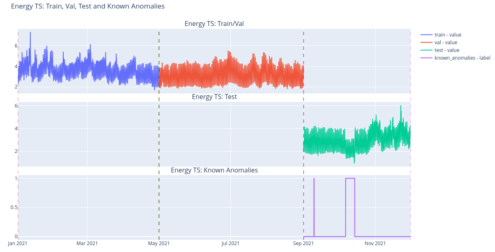
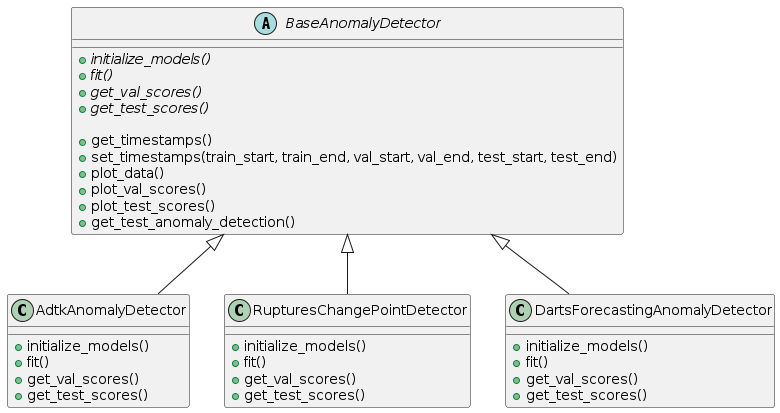

# Easy Time Series Anomaly Detection
# (A framework to use multiple time series libraries)



This project simplifies the exploration and use of several anomaly detection libraries in a common framework.

Time series libraries use, in general, different schemes for data manipulation and processing. The implemented framework overcomes  this difficulty by defining a simple common interface and hiding the differences. This enables the user to integrate complementary algorithms from different libraries without writing specific code.  
Algorithms, parameters and time periods are specified via configuration files which adds to the flexibility of the procedure and also allows for batch processing.    

## Framework

The framework defines a simple common interface for all the libraries as shown in the following class diagram of Figure 1.



**Figure 1.** Simplified class diagram of the framework. Libraries are integrated to the framework by implementing the funcionallity defined in the BaseAnomalyDetector class.

The scheme is flexible and new libraries can be added by implementing the functionalities defined in the BaseAnomalyDetector class.

--------

### Currently integrated libraries 

* ADTK: https://adtk.readthedocs.io/en/stable/  
* DARTS https://unit8co.github.io/darts/  
* RUPTURES http://dev.ipol.im/~truong/ruptures-docs/build/html/index.html , https://centre-borelli.github.io/ruptures-docs/

-------

### Configuration files

Configuration files allow to specify the desired algorithms, parameters and time periods.

The following is an example configuration for the __PersistAD__ anomaly detector from the ADTK library (https://adtk.readthedocs.io/en/stable/notebooks/demo.html#PersistAD) and the periods of time to apply the algorithm.

```yaml
# ADTK -----------------------------------------
adtk_detector:
  class: PersistAD  
  parameters:
    window: 196  
    c: 2
    side: negative
# ADTK -----------------------------------------

# GENERAL --------------------------------------
timestamps:
  train:
    start: "2016-07-01 00:00:00"
    end: "2017-12-31 23:59:59"
    freq: "H"
  val:
    start: "2018-01-01 00:00:00"
    end: "2018-06-30 23:59:59"
    freq: "H"
  test:
    start: "2018-07-01 00:00:00"
    end: "2019-12-31 23:59:59"  
    freq: "H"

logging:
  level: INFO
  file_path: logs/anomaly_detection.log  
# GENERAL --------------------------------------
```

------------


## Installation

* Clone the repository

``` bash
# Change to a convenient directory
cd <convenient_directory>

# Clone or download the repository
git clone <repository>

cd easy_time_series_anomaly_detection
```

* Running the classes and example notebooks requires installing the required libraries in a virtual environment. Create and activate a virtual environment as shown below:

``` bash
conda env create -n easy_ts_ad -f environment.yml

conda activate easy_ts_ad
```

> Note
If using PyTorch models from DARTS, it may be better to install torch first (CPU version, or GPU version if available)  
See PyTorch compatibility and installation instructions here: https://pytorch.org/get-started/locally/  
Check CUDA / NVIDIA driver compatibility here: https://docs.nvidia.com/deeplearning/cudnn/latest/reference/support-matrix.html  
Please refer to: https://github.com/unit8co/darts/blob/master/INSTALL.md  for detailed instructions


## Example notebooks

* [DEMO: Use of the framework](./notebooks/DEMO_use_of_the_framework.ipynb)
* [DEMO: Anomaly detection wih DARTS forecasters](./notebooks/DEMO_example_ad_with_darts_forecasters.ipynb)


## How to cite

If you find this framework useful please cite:

```bibtex
PLACEHOLDER 
@misc{easy_time_series_anomaly_detection_2024,
    title = {{Easy Time Series Anomaly Detection}},
    author = {AUTHOR_NAME},
    year = {2025},
    howpublished = {\url{PLACEHOLDER}},
    note = {Accessed: YYYY-MM-DD}
}
```
